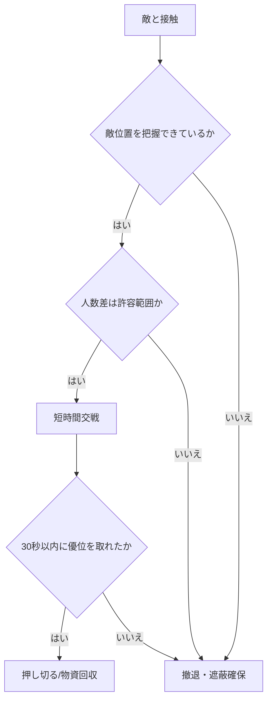

# 撤退判断の基本

## 概要

DMZでは戦闘勝利よりも任務達成・生還・物資回収が優先される。
不利条件が重なった場合は、交戦継続ではなく撤退を標準判断にする。

## 撤退条件

- 敵位置が2方向以上に分かれた
- アーマー残量が不足
- 味方がダウンして位置が割れた
- AIとプレイヤーに挟まれた
- 脱出時間が迫っている

## 判断フロー

## 関連記事

- [[岩場戦闘の基本原則]]
- [[高所を取られて撤退判断が遅れたケース]]
