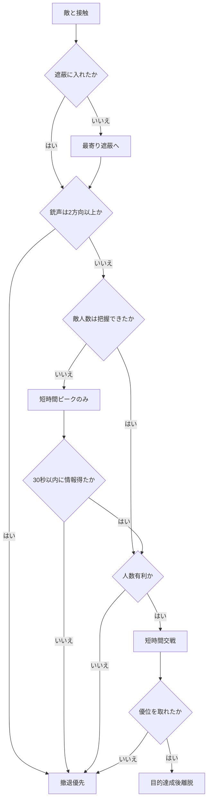

# 初動判断フロー

```mermaid
flowchart TD
A[敵と接触] --> B{遮蔽に入れたか}
B -->|いいえ| C[最寄り遮蔽へ]
B -->|はい| D{銃声は2方向以上か}
C --> D
D -->|はい| E[撤退優先]
D -->|いいえ| F{敵人数は把握できたか}
F -->|いいえ| G[短時間ピークのみ]
F -->|はい| H{人数有利か}
G --> I{30秒以内に情報得たか}
I -->|いいえ| E
I -->|はい| H
H -->|はい| J[短時間交戦]
H -->|いいえ| E
J --> K{優位を取れたか}
K -->|はい| L[目的達成後離脱]
K -->|いいえ| E
```

関連: [[対多人数戦の初動判断]] / [[撤退判断の基本]]
